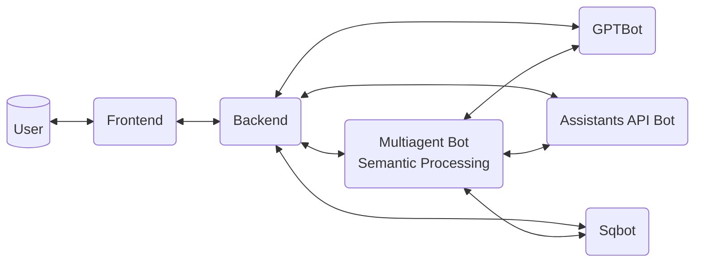

# Adventureworks-AI-Viewer

A demo application to showcase adding intelligence to an application with different levels of complexity.

## Architecture

- Base on the UI selection
  - No AI
  - Chatbot
  - Sqlbot
  - Assistants API Bot
  - Multiagent Bot

## Requirements

### Database

- Deploy Azure SQL Database with Adventure Work to Azure
- Execute the scripts at: `src/backend/database/sql_views_script.sql` to add the supporting views

### Backend

- Python 3.11
- openai==1.16.1
- fastapi==0.110.1
- uvicorn[standard]==0.29.0
- pymssql==2.2.11
- pillow==10.3.0

### Frontend 

- React
- Tailwind CSS
- react-data-grid
- react-icons
- react-loader-spinner
- react-markdown
