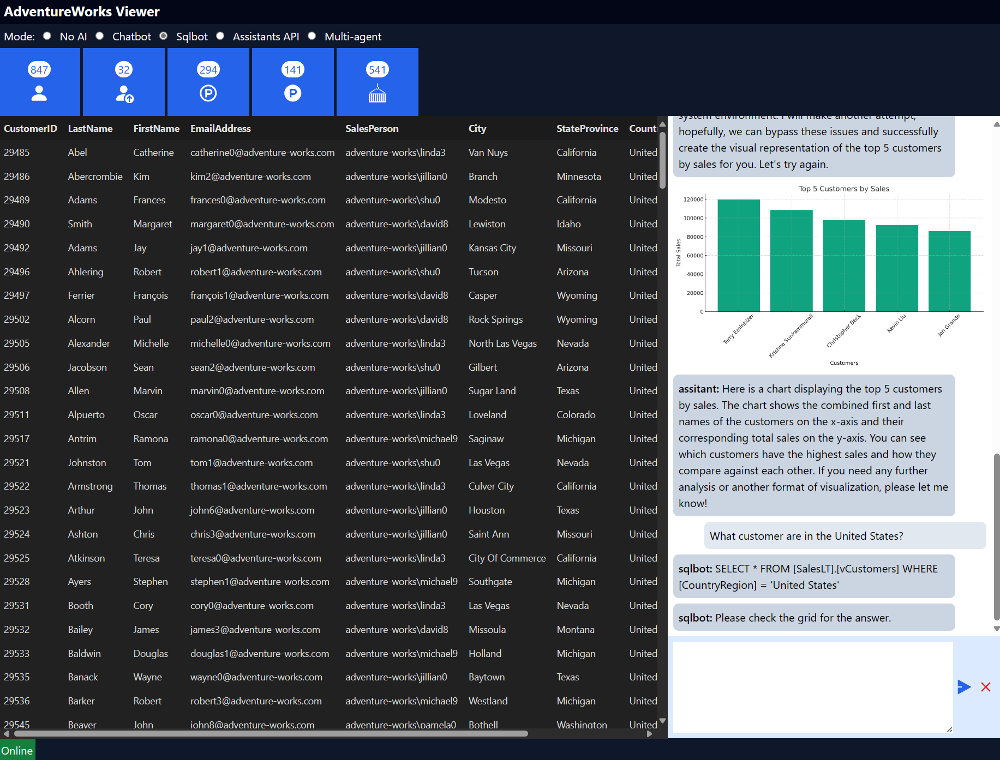
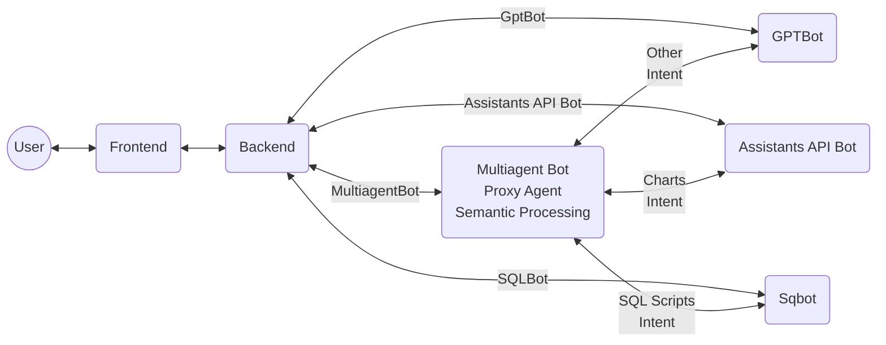
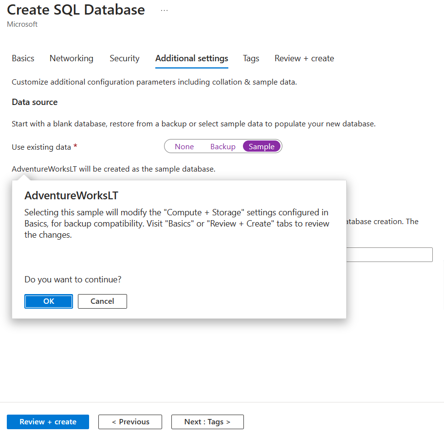

# Adventureworks-AI-Viewer

## Overview

A demo application to showcase adding intelligence to an application at different levels of complexity.



## Architecture



### Application Options

| Selection | Description |
| --------- | ----------- |
| No AI | A user can click on the icons to show the data on the table on the grid in the UI. |
| Chatbot | A user can ask questions related to top customers and products. |
| Sqlbot | A user can ask the system to generate SQL statement. The SQL statements are then executed and presented on the grid in the UI. |
| Assistants API Bot | A user can ask the system to perform complex data analysis related to top customers and top products and generate bars and charts. |
| Multiagent Bot | This Bot will decide which agent to call (Chatbot, SQLbot or Assistant Bot based on the user's intent and will respond accordingly. |

## Requirements

### Database

This app leverages the SQL Adventurework database data. However, additional views need to be deployed. You will need to:

- Deploy Azure SQL Database with AdventuresWorks to Azure



- Execute the scripts at: [src/database/views_script.sql](src/database/views_script.sql) to add the supporting views

### Backend - Python

- Python 3.11
- openai==1.16.1
- fastapi==0.110.1
- uvicorn[standard]==0.29.0
- pymssql==2.2.11
- pillow==10.3.0

### Backend - C# (coming soon)

### Frontend - React

- React
- Tailwind CSS
- react-data-grid
- react-icons
- react-loader-spinner
- react-markdown

## Debugging - Python

- Install the frontend dependencies: `cd src/frontend && npm install`
- Install the backend dependencies: `cd src/backend && pip install -r requirements.txt`
- Create or update the evnironment variable files at: `src/backend/.env`

```bash
DB_SERVER=<NAME>.database.windows.net
DB_USER=<ADMIN_USER>
DB_PASSWORD=<ADMIN_PASSWORD>
DB_DATABASE=<DB_NAME>

OPENAI_FULL_URI=https://<NAME>.openai.azure.com/openai/deployments/gpt4-1106-preview/chat/completions?api-version=2024-02-15-preview
OPENAI_URI=https://<NAME>.openai.azure.com/
OPENAI_KEY=<API_KEY>
OPENAI_GPT_DEPLOYMENT=gpt4-1106-preview
OPENAI_VERSION=2024-02-15-preview
OPENAPI_URL=/openapi.json
```

- Start the backend: `cd src/backend && sh run.sh` or `cd src/backend && uvicorn main:app --reload`
- Start the frontend: `cd src/frontend && npm run dev`


## Debugging - C# (Coming soon)
